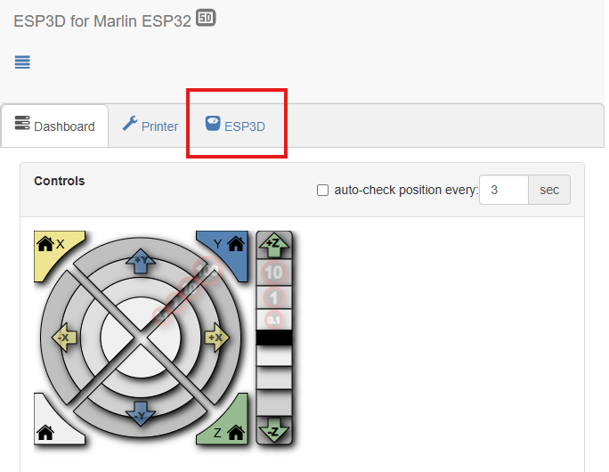
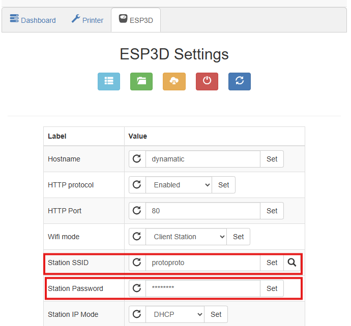

# Dynamatic Control Demo

This repo contains a simple demo to control a Dynamatic over http.


## Running the demo

1. Open the index.html in this repo in a browser. (Tested to work in file mode, but serving it with a simple file server is also an option)
2. Enter the full http:// url of your dynamatic in the url box (Your Dynamatic will show its IP address on its display.)
3. Press buttons


## Demo explained
index.html is just the frontend, all relevant http calls are in dynamatic.js.

There are two types of calls:
1. GET requests that send GCODE commands that are processed immediately, line by line.
2. A POST request that uploads a .g (gcode file)

The `makeWire` function does a little bit of both. It inserts the input length into the GCODE template, creates a blob and wraps it in a formdata object. This formdata object is the POSTed to the /upload endpoint. This (over)writes the wire.g file to the SD card.

Then we send a GET request with the command "[M23](https://marlinfw.org/docs/gcode/M023.html "M23: Select SD File") /WIREG~1.G\n[M24](https://marlinfw.org/docs/gcode/M024.html "M24: Start or Resume SD print")",
this select wire.g from the SD card, and "Prints" it.

See https://marlinfw.org/meta/gcode/ for all the commands you can utilize in your GCODE Files.

## Hardware configuration

| Axis | Function  | Unit           | Notes |
| ---- | --------- | -------------- | ----- |
| X    | Wire feed | mm             |       |
| Z    | Clamp     | Half rotations |       |


The X axis will feed the amount in mm you specify, and has been calibrated with this [0.7mm dyneema thread](https://touwhuisdenoude.nl/producten/vliegerlijn-dyneema-zeer-dun-100m-wit/). It does not take into account the loss of length in the thread resulting from the melting procedure. You will need to take this loss, plus any extra thread length required for the knots into account when sending a X feed command. 

The Z axis has been configured in the made up unit of "half rotations". On startup, the clamp will do a homing procedure, defining the open position as 0. This means that 1 is "active", or closed. The motor that powers this axis needs to stay powered to the keep the clamp open, it might be a good idea to turn the machine off when idle for a long time.

The included GCODE template sets the clamp/z back to 0 after the file is done, but not the x axis. Thus, the x axis will show the amount of thread extruded in the current session.


## Network connection

### 1. Connecting to your Dynamatic

When Dynamatic can't connect to a stored network, it will go into Access Point mode.  

Connect to the following network:
```
SSID: dynamatic  
Password: protoproto
```

When you're connected, the standard web interface is accessible at http://192.168.0.1. This is also the url you need to enter in the demo.


You can either leave it in access point mode (might be useful on the road), or connect it to your local WiFi.


### 2. (Optional) Connecting to an existing WiFi network

1. Make sure you're connected to the dynamatic access point.
2. Open the web interface: http://192.168.0.1
3. Open the "ESP3D" tab  

4. Enter the SSID and password of the network you want to connect to, press Set at each box to store the setting.

5. Make sure you pressed Set ;)
6. Power cycle your machine

Dynamatic will reboot and attempt to connect to the network you entered. If it is unsuccessful, it will go into access point mode again.
If the connection is successful (and assuming you're using default settings), your Dynamatic will get an ip through DHCP, and show it on the display. 


> <span style="font-size: 1.2rem; float: left; padding: 0 10px 0 0">👉</span> 
> If you plan on switching your Dynamatic between AP and client mode frequently, it might be useful to set it up in such a way that it has the same IP address either way. You could set an IP address reservation in your router, and then change the "AP Static IP" setting to that same address.


